# Synchronous FIFO memory:

## Introduction to FIFO memory:

A FIFO is a special type of buffer. The name FIFO stands for first in first out and means that the data written into the buffer
first comes out of it first. There are other kinds of buffers like the LIFO (last in first out), often called a stack memory, and the
shared memory. The choice of a buffer architecture depends on the application to be solved.

 Every memory in which the data word that is written in first also comes out first when the memory is read is a first-in first-out
 memory. Figure below illustrates the data flow in a FIFO. There are three kinds of FIFO:
 
 • Shift register – FIFO with an invariable number of stored data words and, thus, the necessary synchronism between
 the read and the write operations because a data word must be read every time one is written.
 
 • Exclusive read/write FIFO – FIFO with a variable number of stored data words and, because of the internal structure,
 the necessary synchronism between the read and the write operations.
 
 • Concurrent read/write FIFO – FIFO with a variable number of stored data words and possible asynchronism
 between the read and the write operation.

 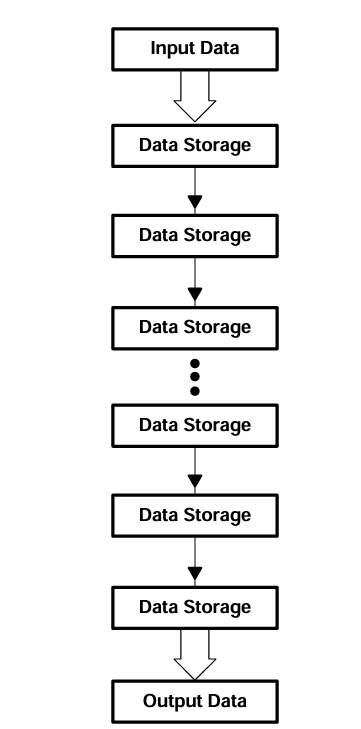  

## Concurrent Read/Write FIFOs:
 In concurrent read/write FIFOs, there is no dependence between the writing and reading of data. Simultaneous writing and
 reading are possible in overlapping fashion or successively. This means that two systems with different frequencies can be
 connected to the FIFO. The designer need not worry about synchronizing the two systems because this is taken care of in the
 FIFO. Concurrent read/write FIFOs, depending on the control signals for writing and reading, fall into two groups:
 
 • Synchronous FIFOs.
 
 • Asynchronous FIFOs.

 ## Synchronous FIFOs:

### FIFOs block summary:
  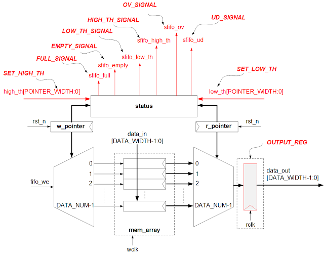  

The block diagram in Figure below shows all the signal lines of a synchronous FIFO. It requires a free-running clock from the
 writing system and another from the reading system. Writing is controlled by the WRITE ENABLE input synchronous with
 WRITE CLOCK. The FULL
 status line can be synchronized entirely with WRITE CLOCK by the free-running clock. In an
 analogous manner, data words are read out by a low level on the READ ENABLE input synchronous with READ CLOCK.
 Here, too, the free-running clock permits 100 percent synchronization of the EMPTY signal with READ CLOCK.
 
  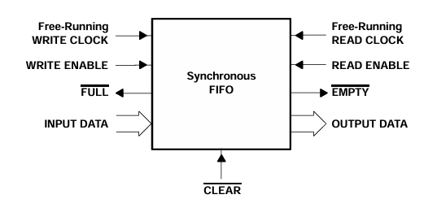 
  In there:
  
  - data_out: FIFO data output.
  - fifo_full: FIFO full output signal. 
  - fifo_empty: FIFO empty output signal.
  - fifo_overflow_flag: FIFO overflow output signal.
  - fifo_underflow_flag: FIFO underflow output signal.
  - clk: Synchronous clock signal.
  - rst_n: Synchronous reset signal.
  - w_en: Write enable signal.
  - r_en: Read enable signal.
  - data_in: FIFO data input.
  
Timing diagram below shows the typical waveform in a synchronous FIFO. WRITE CLOCK and READ CLOCK are free running. The
 writing of new data into the FIFO is initialized by a low level on the WRITE ENABLE line. The data are written into the FIFO
 with the next rising edge of WRITE CLOCK. In analogous fashion, the READ ENABLE line controls the reading out of data
 synchronous with READ CLOCK.
 
 All status lines within the FIFO can be synchronized by the two free-running-clock signals. The FULL line only changes its
 level synchronously with WRITE CLOCK, even if the change is produced by the reading of a data word. Likewise, the EMPTY
 signal is synchronized with READ CLOCK. A synchronous FIFO is the only concurrent read/write FIFO in which the status
 signals are synchronized with the driving logic

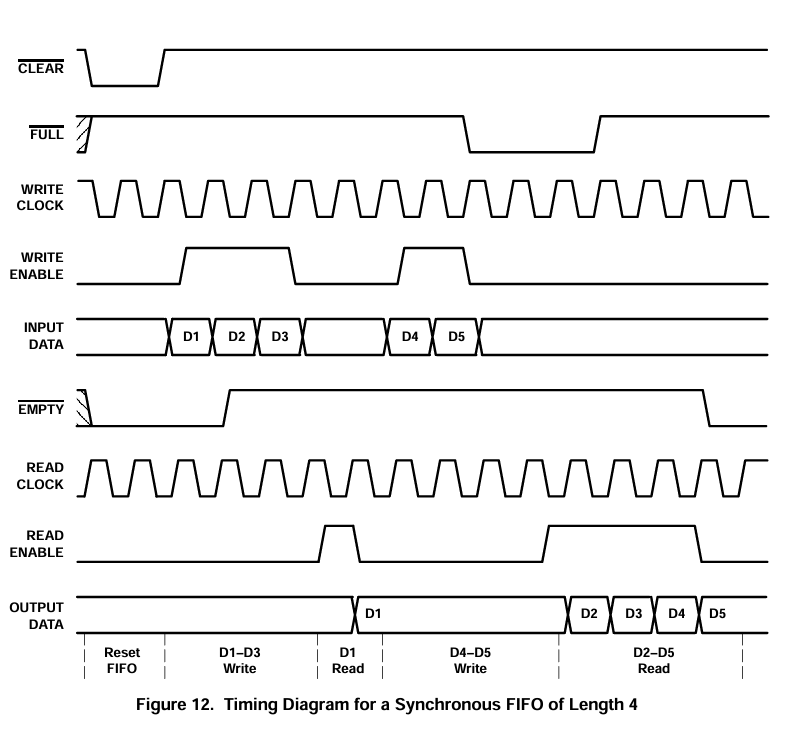  


### FIFO with Static memory:
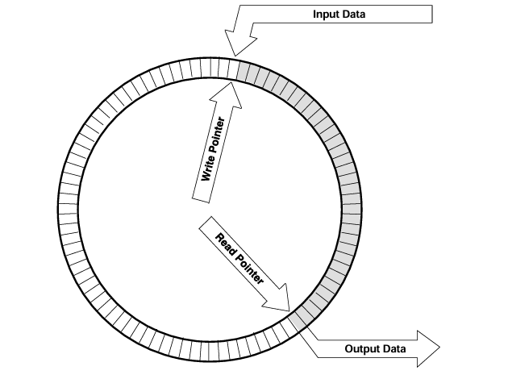  

In a circular FIFO concept, the memory address of the incoming data is in the write pointer. The address of the first data word
 in the FIFO that is to be read out is in the read pointer. After reset, both pointers indicate the same memory location. After each
 write operation, the write pointer is set to the next memory location. The reading of a data word sets the read pointer to the
 next data word that is to be read out. The read pointer constantly follows the write pointer. When the read pointer reaches the
 write pointer, the FIFO is empty. If the write pointer catches up with the read pointer, the FIFO is full.

 ### Architecture:
   

 ### Synchronous of Flags:
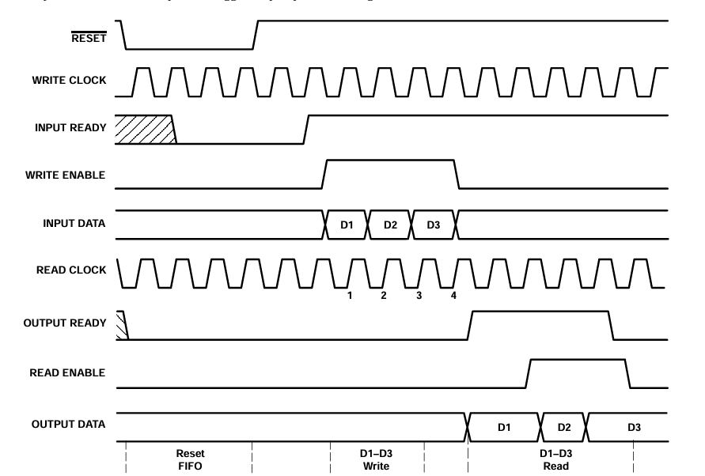  

### FIFO Architecture Analysis:

#### 1. Read/Write pointer:
 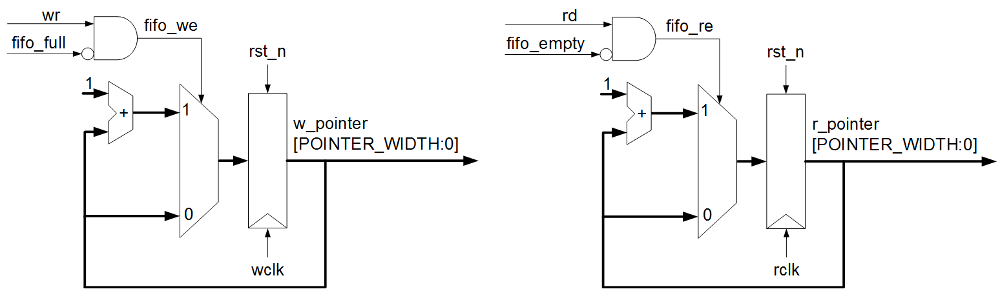  

```SystemVerilog
module Write_pointer #(
  									parameter DATASIZE=8, 
									parameter DEPTH=16,
  									parameter PTR_WIDTH=$clog2(DEPTH)
//   									parameter PTR_WIDTH=5

)
(
	w_en,
  	rst_n,
  	clk,
	fifo_full,
  	fifo_w_en,
  	w_ptr
);
  input w_en,fifo_full,clk,rst_n;
  output reg [PTR_WIDTH:0] w_ptr;
  output wire fifo_w_en;
  
  assign fifo_w_en= (~fifo_full)&w_en;
  always@(posedge clk or negedge rst_n)	begin
    if(!rst_n)	w_ptr<=0;
    else if(fifo_w_en)
      w_ptr<=w_ptr+1;
    else 
      w_ptr<=w_ptr;
  end
endmodule

module Read_pointer #(
  									parameter DATASIZE=8, 
									parameter DEPTH=16,
  									parameter PTR_WIDTH=$clog2(DEPTH)
//   									parameter PTR_WIDTH=5

)
(
	r_en,
  	rst_n,
  	clk,
	fifo_empty,
  	fifo_r_en,
  	r_ptr
);
  input r_en,fifo_empty,clk,rst_n;
  output reg [PTR_WIDTH:0] r_ptr;
  output wire fifo_r_en;
  
  assign fifo_r_en= (~fifo_empty)&r_en;
  always@(posedge clk or negedge rst_n)	begin
    if(!rst_n)	r_ptr<=0;
    else if(fifo_r_en)
      r_ptr<=r_ptr+1;
    else 
      r_ptr<=r_ptr;
  end
endmodule
```
### 2. Memory State alert circuit:
 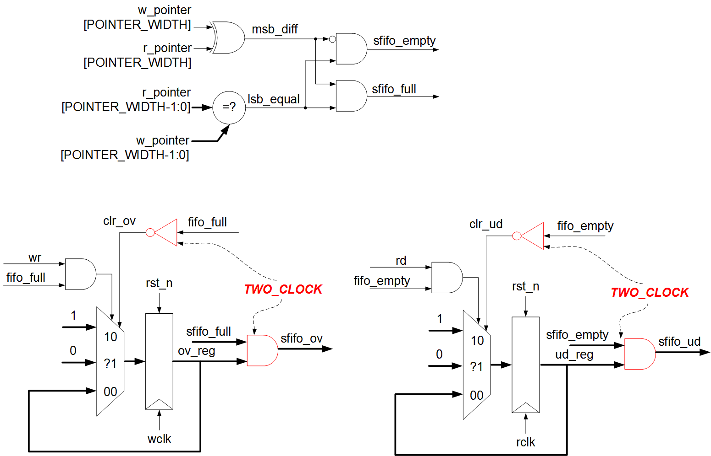  

```SystemVerilog
module Memory_State #(
  									parameter DATASIZE=8, 
									parameter DEPTH=16,
  									parameter PTR_WIDTH=$clog2(DEPTH)
//   									parameter PTR_WIDTH=5

)
(
	fifo_full,
    fifo_empty,
    fifo_overflow_flag,
    fifo_underflow_flag,
    w_en,
    r_en,
    fifo_w_en,
    fifo_r_en,
    w_ptr,
    r_ptr,
    clk,
    rst_n
);
  	input clk,rst_n,w_en,r_en,fifo_w_en,fifo_r_en;
  	input wire [PTR_WIDTH:0] w_ptr,r_ptr;
	wire msb_diff,lsb_equal;
  	output reg fifo_empty,fifo_full;
  	output reg fifo_overflow_flag,fifo_underflow_flag;
  	wire fifo_overflow_set,fifo_underflow_set;
  	assign msb_diff= w_ptr[PTR_WIDTH]^r_ptr[PTR_WIDTH];
  	assign lsb_equal= w_ptr[PTR_WIDTH-1:0]-r_ptr[PTR_WIDTH-1:0] ? 0:1;
  	assign fifo_overflow_set= fifo_full&w_en;
  	assign fifo_underflow_set= fifo_empty&r_en;
  	
  	always@(*)	begin
    	 fifo_full=msb_diff&lsb_equal;
  		 fifo_empty=lsb_equal&(~msb_diff);
    end
  
  always@(posedge clk or negedge rst_n) begin
    if(~rst_n)  fifo_overflow_flag <=0; 
    else if((fifo_overflow_set==1)&&(fifo_r_en==0))  
   fifo_overflow_flag <=1;  
    else if(fifo_r_en)  
    fifo_overflow_flag <=0;  
    else  
     fifo_overflow_flag <= fifo_overflow_flag;  
  end  
    
  always @(posedge clk or negedge rst_n)  
  begin  
    if(~rst_n) fifo_underflow_flag <=0;  
    else if((fifo_underflow_set==1)&&(fifo_w_en==0))  
   fifo_underflow_flag <=1;  
    else if(fifo_w_en)  
    fifo_underflow_flag <=0;  
    else  
     fifo_underflow_flag <= fifo_underflow_flag;  
  end  
endmodule  
```

### 3. FIFOs:
 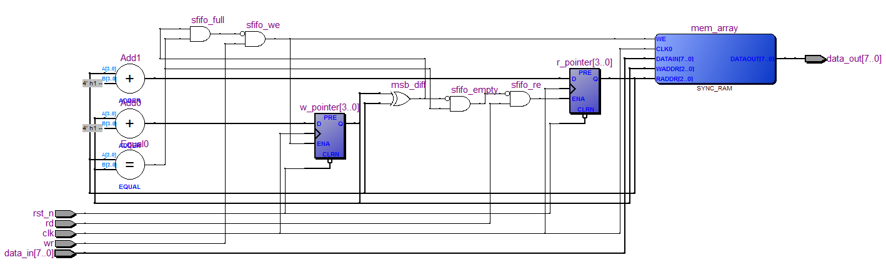  

```SystemVerilog
module Synchronous_FiFo_memmory #(
  									parameter DATASIZE=8, 
									parameter DEPTH=16,
  									parameter PTR_WIDTH=$clog2(DEPTH)
//   									parameter PTR_WIDTH=5

)
(
  data_out,
  fifo_full,
  fifo_empty,
  fifo_overflow_flag,
  fifo_underflow_flag,
  clk,
  rst_n,
  w_en,
  r_en,
  data_in
);  
  input w_en, r_en, clk, rst_n;  
  input[DATASIZE-1:0] data_in;   // FPGA projects using Verilog/ VHDL
  output[DATASIZE-1:0] data_out;  
  output fifo_full, fifo_empty,  fifo_overflow_flag, fifo_underflow_flag;  
  wire[PTR_WIDTH:0] w_ptr,r_ptr;  
  wire fifo_w_en,fifo_r_en;   
  Write_pointer top1(
    w_en,
  	rst_n,
  	clk,
	fifo_full,
  	fifo_w_en,
  	w_ptr
  );  
  
  Read_pointer  top2(
    r_en,
  	rst_n,
  	clk,
	fifo_empty,
  	fifo_r_en,
  	r_ptr
  );  
  
  Memory_Array  top3(
    clk,
  	rst_n,
  	fifo_w_en,
  	w_ptr,
  	r_ptr,
  	data_in,
  	data_out
  );  
  
  Memory_State top4(
    fifo_full,
    fifo_empty,
    fifo_overflow_flag,
    fifo_underflow_flag,
    w_en,
    r_en,
    fifo_w_en,
    fifo_r_en,
    w_ptr,
    r_ptr,
    clk,
    rst_n
  );  
 endmodule  
```

## Simulation:
### EPWAVE:
 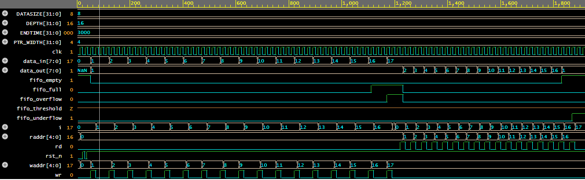  

### Log file:

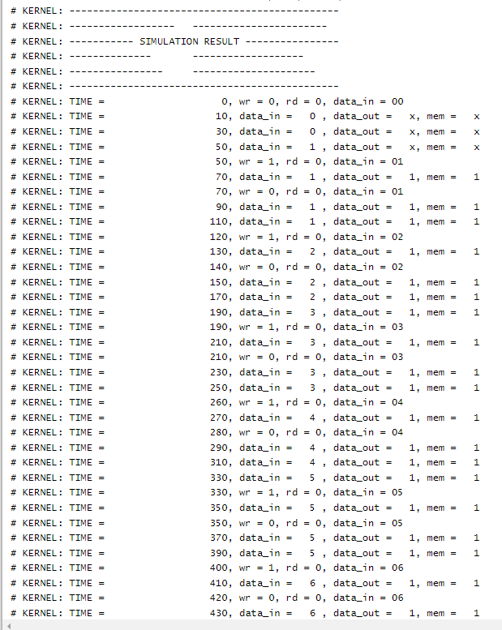  


My code in EDA Playground: [Synchronous FIFO memory](https://edaplayground.com/x/Mg_k)
